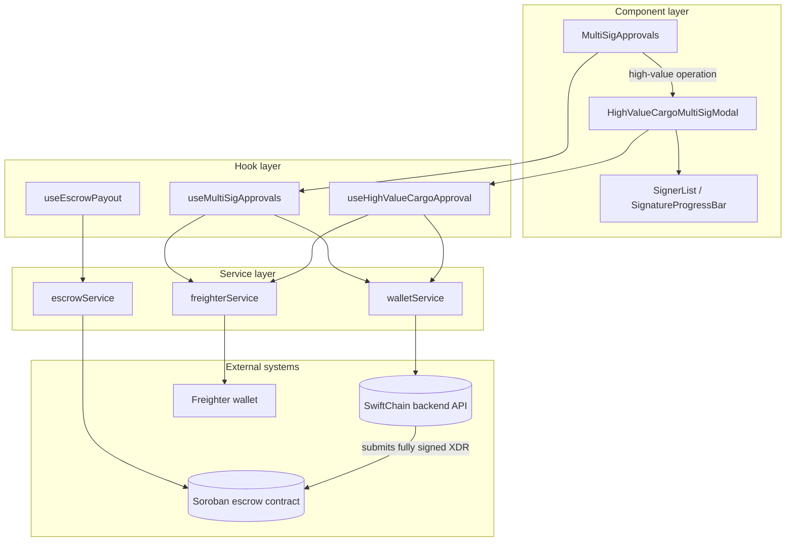
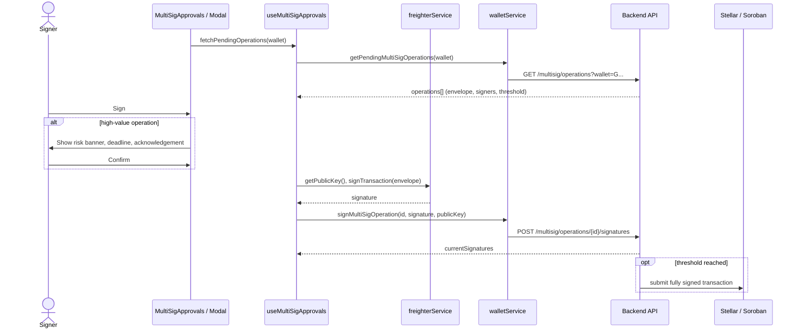

# Multi-Signature Approval Architecture

This guide describes how SwiftChain collects multiple signatures before escrow funds move, how signer weights and thresholds work, how shipments are classified by risk, and which backend endpoints the frontend relies on.

It covers both the general multi-sig flow (`MultiSigApprovals`) and the stricter flow for high-value cargo.

## Contents

- [Status of the building blocks](#status-of-the-building-blocks)
- [Architecture](#architecture)
- [Signer weights and thresholds](#signer-weights-and-thresholds)
- [Risk classification](#risk-classification)
- [API reference](#api-reference)
- [Security considerations](#security-considerations)
- [Adding a new approval surface](#adding-a-new-approval-surface)

## Status of the building blocks

The high-value flow is being built across several issues. Use this table to know what you can depend on today.

| Piece | Path | Status |
| --- | --- | --- |
| Pending approvals widget | `components/wallet/MultiSigApprovals.tsx` | Available |
| Pending approvals hook | `hooks/useMultiSigApprovals.ts` | Available |
| Signer list / progress bar | `components/escrow/SignerList.tsx`, `components/escrow/SignatureProgressBar.tsx` | Available |
| Escrow release hook (Soroban) | `hooks/useEscrowPayout.ts` → `services/escrowService.ts` | Available |
| Freighter signing | `services/freighterService.ts` | Available |
| Wallet service multi-sig methods | `walletService.getPendingMultiSigOperations`, `walletService.signMultiSigOperation` | Called by the hook, **not yet implemented** in `services/walletService.ts` |
| High-value threshold detection | `useMultiSigApprovals` options | In review (#793) |
| High-value approval modal | `components/escrow/HighValueCargoMultiSigModal.tsx` | Planned (#791) |
| High-value approval hook | `hooks/useHighValueCargoApproval.ts` | Planned (#792) |

## Architecture

All approval UI follows the project's strict **Component → Hook → Service** layering. Components never call Axios, Freighter or Soroban directly.



### Signing sequence

Each signer signs the same transaction envelope in their own wallet. The backend aggregates signatures and submits the transaction only when the threshold is met.



## Signer weights and thresholds

SwiftChain uses two related mechanisms. Keep them apart when reading the code.

### Stellar account thresholds (weighted)

Escrow accounts on Stellar carry a list of signers, each with a **weight** from 0 to 255. The account has three thresholds: `low`, `medium` and `high`. A transaction is authorised when the **sum of the weights of the signers who signed** is at least the threshold for the operations it contains. Payments and escrow releases are medium-threshold operations; changing signers or thresholds (`SetOptions`) is high-threshold.

```text
authorised  ⇔  Σ weight(signer) for every signer who signed  ≥  threshold
```

The frontend receives signers as `{ publicKey, weight, approved }` and the threshold as `signaturesRequired`. `SignatureProgressBar` renders `currentSignatures / signaturesRequired`. For weighted accounts, the backend should report both values in weight units, so the bar reflects how close the operation is to authorisation. If the signer count is used instead, a heavy signer's approval looks smaller than it really is.

### Soroban escrow contract threshold (count based)

The escrow contract read by `escrowService.getEscrowDetails` stores a `threshold` and a list of `signatures`. It counts **distinct signers**, not weights. `useEscrowPayout` enables release when `currentSignatures >= requiredSignatures`.

### Configuration examples

**Standard shipment: 2 of 3, equal weights.**

| Signer | Weight |
| --- | --- |
| Customer | 1 |
| Driver | 1 |
| Platform | 1 |

Medium threshold: **2**. Any two parties can release funds, and no single party can.

**High-value shipment: customer and one guarantor must agree.**

| Signer | Weight |
| --- | --- |
| Customer | 2 |
| Platform | 1 |
| Insurer | 1 |
| Driver | 0 (observer) |

Medium threshold: **3**. Release needs the customer (2) plus the platform or the insurer (1). Platform and insurer together (2) are not enough. The driver can view the operation but cannot move funds.

**Admin override for disputes.**

| Signer | Weight |
| --- | --- |
| Customer | 1 |
| Driver | 1 |
| Dispute admin | 2 |

Medium threshold: **2**. The dispute admin alone can resolve a stalled escrow. Only use this where the arbitration policy allows it, and set the high threshold (for signer changes) to at least **3**, so no single party can rewrite the signer set.

### Rules for choosing values

- Keep `threshold ≤ sum of all weights`, or funds become permanently locked.
- Keep the high threshold above the weight of any single signer, so no one party can add or remove signers.
- Give observers weight `0` rather than leaving them off the list, so the UI can still show them.

## Risk classification

Operations are classified from the XLM amount they move. The threshold is resolved in this order:

1. The `highValueThresholdXlm` option passed to the hook
2. `NEXT_PUBLIC_MULTISIG_HIGH_VALUE_THRESHOLD_XLM`
3. The default of **10,000 XLM**

| Risk level | Rule | Default range | Approval flow |
| --- | --- | --- | --- |
| `low` | amount < 50% of threshold, or amount unknown | < 5,000 XLM | Standard one-click signing in `MultiSigApprovals` |
| `medium` | 50% of threshold ≤ amount < threshold | 5,000 – 9,999.99 XLM | Standard signing, flagged in the list |
| `high` | amount ≥ threshold | ≥ 10,000 XLM | Held; must be confirmed in `HighValueCargoMultiSigModal` |

### Worked examples

With the default threshold of 10,000 XLM:

| Amount | Level |
| --- | --- |
| 1,200 XLM | `low` |
| 5,000 XLM | `medium` (the boundary is inclusive) |
| 9,999.99 XLM | `medium` |
| 10,000 XLM | `high` |
| not reported | `low` |

With `NEXT_PUBLIC_MULTISIG_HIGH_VALUE_THRESHOLD_XLM=2500` (for example on testnet), anything from 1,250 XLM is `medium` and from 2,500 XLM is `high`.

### High-value modal requirements

Before a high-value signature is submitted, the modal must:

- show a risk banner with the amount and its fiat equivalent
- list every signer with their weight and approval state
- show a countdown to the approval deadline (`expiresAt`)
- require an explicit acknowledgement checkbox
- keep the submit button disabled until the acknowledgement is checked and the deadline has not passed
- close on `Escape` without signing

## API reference

These are the endpoints the frontend services call, relative to `NEXT_PUBLIC_API_URL`. All require the JWT bearer token that `lib/api.ts` attaches. Endpoints marked **Planned** define the contract that #791 and #792 will build against.

| Method | Endpoint | Used by | Request | Response | Status |
| --- | --- | --- | --- | --- | --- |
| `GET` | `/multisig/operations?wallet={G...}` | `walletService.getPendingMultiSigOperations` | query `wallet` | `{ success, operations: PendingMultiSigOperation[], message? }` | Expected by the hook |
| `POST` | `/multisig/operations/{operationId}/signatures` | `walletService.signMultiSigOperation` | `{ signature, signerPublicKey }` | `{ success, currentSignatures, message? }` | Expected by the hook |
| `GET` | `/multisig/config` | risk threshold | – | `{ highValueThresholdXlm, mediumRiskRatio }` | Planned |
| `GET` | `/multisig/high-value/{shipmentId}` | `useHighValueCargoApproval` | – | operation, signers, `riskLevel`, `amountXlm`, `expiresAt` | Planned |
| `POST` | `/multisig/high-value/{shipmentId}/approve` | `useHighValueCargoApproval` | `{ signature, signerPublicKey, acknowledged: true }` | `{ success, currentSignatures, thresholdMet }` | Planned |
| `POST` | `/multisig/high-value/{shipmentId}/reject` | `useHighValueCargoApproval` | `{ signerPublicKey, reason }` | `{ success }` | Planned |

The escrow contract itself is read and invoked from `services/escrowService.ts` over Soroban RPC (`NEXT_PUBLIC_SOROBAN_RPC_URL`). It does not go through the REST API.

### `PendingMultiSigOperation`

```ts
interface PendingMultiSigOperation {
  operationId: string;
  transactionEnvelope: string;   // base64 XDR every signer signs
  description: string;
  signaturesRequired: number;    // threshold
  currentSignatures: number;     // approved weight so far (same unit as signaturesRequired)
  signers: { publicKey: string; weight: number; approved: boolean }[];
  amountXlm?: number;            // enables risk classification
  createdAt: string;             // ISO 8601
  expiresAt: string;             // ISO 8601
  status: 'pending' | 'signed' | 'rejected' | 'expired';
}
```

## Security considerations

- **The chain is the authority.** Risk classification and button states on the client are advisory UX. The backend must re-derive the risk level from the transaction itself, and Stellar thresholds or the Soroban contract must enforce the signature rules. Never trust `riskLevel`, `amountXlm` or `acknowledged` sent by the client.
- **Sign exactly what is shown.** The backend must build the displayed amount, destination and description from the decoded `transactionEnvelope`, not from separate fields. Otherwise a signer could approve a summary that differs from the transaction.
- **Private keys never touch the app.** Signing always goes through `freighterService`. Only signatures and public keys are sent to the API.
- **Check the network passphrase.** Signatures are bound to the network. Make sure `NEXT_PUBLIC_NETWORK_PASSPHRASE` matches the backend, so a testnet signature can't be replayed against mainnet assumptions and the reverse.
- **Expiry and replay.** Give every operation a transaction time bound matching `expiresAt`, and reject signatures for expired, rejected or already-submitted operations on the server. The UI disables signing after expiry, but that is not a control.
- **One signer, one vote.** The backend must deduplicate signatures by public key and verify each one against the envelope hash before counting its weight.
- **Protect the signer set.** Keep the high threshold above any single weight, as described in [Rules for choosing values](#rules-for-choosing-values). Changing signers or weights is itself a high-value operation.
- **Audit everything.** Record every approval, rejection and threshold change as an audit event (`/api/audit/...`), so it shows up in the audit trail views.
- **Threshold configuration is public.** `NEXT_PUBLIC_*` variables ship in the client bundle. That is fine for a display threshold, but the enforced threshold must live on the server.

## Adding a new approval surface

1. Add or extend a service method in `services/` for any new endpoint. Components and hooks never import Axios.
2. Put the state, polling and signing orchestration in a hook under `hooks/`, and reuse `freighterService` for signing.
3. Keep the component presentational: signer list, progress, risk banner, deadline and actions.
4. Add hook tests that mock the service, and component tests that mock the hook.
5. Update this document if you add endpoints or change the risk rules.
