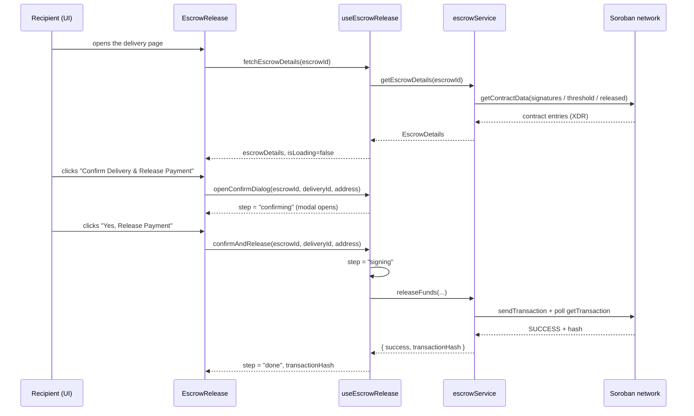

# Settlement Confirmation — Implementation Guide

This document describes the **Settlement Confirmation** screen: the post-delivery
step where the recipient confirms that goods were received and releases the
escrowed funds to the driver.

It covers the screen architecture, the data flow, the currency-formatting rules,
the display types, a copy‑paste usage example, and the accessibility contract.

> **Architecture rule:** this feature follows the project's strict
> **Component → Hook → Service** layering. Components never call the network
> directly, hooks never import `axios`/SDK clients, and services never touch
> React state. All data comes from the backend/Soroban network — there are no
> inline mocks in production code.

---

## 1. File structure

```
features/escrow/components/
  EscrowRelease.tsx                     # The settlement confirmation UI (Component)
  __tests__/
    EscrowRelease.test.tsx              # 26 unit tests for the screen
hooks/
  useEscrowRelease.ts                   # Release state machine (Hook)
services/
  escrowService.ts                      # Soroban / API access (Service)
types/
  escrow.ts                             # EscrowDetails, ReleaseFundsResponse
lib/
  transactionFormatters.ts              # Amount / status / corridor formatting
```

The single entry point is `EscrowRelease`. Everything it needs is reached through
`useEscrowRelease`, which in turn is the only consumer of `escrowService`.

---

## 2. Architecture — Component → Hook → Service

| Layer         | File                                   | Responsibility                                                                 |
| ------------- | -------------------------------------- | ------------------------------------------------------------------------------ |
| **Component** | `features/escrow/components/EscrowRelease.tsx` | Render the summary, the confirm modal, and the step-specific UI. No I/O.        |
| **Hook**      | `hooks/useEscrowRelease.ts`            | Own the release state machine, orchestrate service calls, surface toasts.       |
| **Service**   | `services/escrowService.ts`            | Read escrow contract state and invoke `release_funds` on Soroban.               |
| **Types**     | `types/escrow.ts`                      | Shared wire/display contracts consumed by hook and component.                   |

### Request flow



---

## 3. Data flow & release state machine

`useEscrowRelease` models the flow as an explicit finite state machine. The
`ReleaseStep` union is:

```ts
export type ReleaseStep = 'idle' | 'confirming' | 'signing' | 'releasing' | 'done';
```

| Step         | Meaning                                                    | UI shown                                        |
| ------------ | ---------------------------------------------------------- | ----------------------------------------------- |
| `idle`       | Ready. No modal, no transaction in flight.                 | Summary + primary action button                 |
| `confirming` | The confirmation modal is open.                            | `ConfirmModal` (`role="dialog"`)                |
| `signing`    | Wallet is prompting the user to approve.                   | Spinner + "Waiting for wallet approval…"        |
| `releasing`  | Transaction submitted, awaiting chain confirmation.        | Spinner + "Releasing payment…"                  |
| `done`       | Chain confirmed the release.                               | Success panel + transaction hash                |

Transitions:

```
idle ──openConfirmDialog──▶ confirming ──confirmAndRelease──▶ signing ──▶ releasing ──▶ done
  ▲                              │                                             │
  └────────── reset() / error ───┴───────────────── on failure ────────────────┘
```

- **On any error** (rejected signature, network failure, contract revert) the
  hook resets to `idle` and fires an error toast via `sonner`. The user can retry.
- **`reset()`** returns to `idle` and clears `transactionHash` (used by the
  modal's Cancel button).
- **`isLoading`** only covers the initial `fetchEscrowDetails` call; it drives the
  skeleton state, not the release transaction.

---

## 4. Component reference

### `EscrowRelease`

```ts
interface EscrowReleaseProps {
  /** On-chain escrow contract address. */
  escrowId: string;
  /** Backend delivery id associated with the escrow. */
  deliveryId: string;
}
```

It also reads the connected wallet from the shared store
(`useWalletStore`, fields `address` and `isConnected`).

Render branches, in order:

1. **Loading** — skeleton shown while `isLoading` is `true`.
2. **Not connected** — amber prompt: *"Connect your wallet to release the escrow payment."*
3. **Already released** — green "Payment Already Released" summary
   (when `escrowDetails.status === 'released'`).
4. **Main UI** — summary card, in-progress / done panels, primary action button,
   optional connected-wallet display, and the confirmation modal.

### Usage example

Drop the component into the delivery detail route and pass the escrow contract
address and delivery id through. All other data is fetched by the hook.

The delivery detail route (`app/(dashboard)/deliveries/[id]/page.tsx`) already
reads the delivery id from `params`. Pass it alongside the escrow contract
address resolved for that delivery:

```tsx
// app/(dashboard)/deliveries/[id]/page.tsx
import { EscrowRelease } from '@/features/escrow/components/EscrowRelease';

export default function DeliveryDetailsPage({
  params,
}: {
  params: { id: string };
}) {
  const deliveryId = params.id;

  // The Soroban contract address stored against the delivery. Source this from
  // the delivery record (server fetch) — it is illustrative here only.
  const escrowId = 'C...ESCROW_CONTRACT_ADDRESS';

  return (
    <div className="p-6">
      <h1 className="text-2xl font-semibold">Delivery Details: {deliveryId}</h1>

      <EscrowRelease escrowId={escrowId} deliveryId={deliveryId} />
    </div>
  );
}
```

The component is self-contained: it fetches its own escrow details on mount
(`fetchEscrowDetails(escrowId)` inside a `useEffect`) and re-fetches whenever
`escrowId` changes.

---

## 5. Hook reference — `useEscrowRelease`

```ts
function useEscrowRelease(): {
  escrowDetails: EscrowDetails | null;
  step: ReleaseStep;
  isLoading: boolean;
  transactionHash: string | null;
  fetchEscrowDetails: (escrowId: string) => Promise<void>;
  openConfirmDialog: (escrowId: string, deliveryId: string, walletAddress: string) => void;
  confirmAndRelease: (escrowId: string, deliveryId: string, walletAddress: string) => Promise<void>;
  reset: () => void;
};
```

Behavioural notes:

- `openConfirmDialog` guards against a missing wallet address and shows an error
  toast instead of opening the modal when none is connected.
- `confirmAndRelease` never throws to its caller — failures are converted into an
  error toast and the step falls back to `idle`.
- On success the hook optimistically flips the local `escrowDetails.status` to
  `released` so the UI reflects the new state without a refetch.
- Toasts come from `sonner`: `info` on signing, `success` on release, `error` on
  failure.

---

## 6. Types

### Existing contracts (`types/escrow.ts`)

```ts
/** Escrow state read from the Soroban contract. */
export interface EscrowDetails {
  requiredSignatures: number;
  currentSignatures: number;
  isReleased: boolean;
  signers: string[];
}

/** Result of a successful `release_funds` invocation. */
export interface ReleaseFundsResponse {
  success: boolean;
  transactionHash: string;
}
```

### `SettlementBreakdown` (display contract)

The confirmation summary renders a small, presentation-oriented view of the
escrow. `SettlementBreakdown` is the display contract for that summary — the
amount, asset, and status the modal and summary card show to the user:

```ts
// types/settlementConfirmation.ts
import type { EscrowStatus } from '@/types/status';

/**
 * Presentation-only view of an escrow, shaped for the settlement confirmation
 * summary and modal. Derived from EscrowDetails + delivery/token metadata.
 */
export interface SettlementBreakdown {
  /** On-chain escrow contract address. */
  escrowId: string;
  /** Backend delivery id the escrow settles. */
  deliveryId: string;
  /** Human-readable settlement amount (already formatted for display). */
  amount: string;
  /** ISO asset/currency code, e.g. `XLM`, `USDC`, `NGN`. */
  currency: string;
  /** Lifecycle state of the escrow. */
  status: EscrowStatus;
  /** Transaction hash once the funds have been released. */
  transactionHash?: string;
}
```

> **Status:** `SettlementBreakdown` is a **proposed display contract**. It is not
> yet present in the codebase; the current screen reads a flatter shape from the
> hook. Adopt this type when wiring the component to the formatters in §7 (see
> the integration checklist in §10).

---

## 7. Currency & amount formatting

All money rendering goes through `lib/transactionFormatters.ts` so the UI stays
consistent across corridors and host `Intl` builds. Amounts are printed as a
locale-grouped number followed by the **ISO code**, never a localised symbol —
several currencies in our corridors share the `$` symbol.

| Formatter                  | Output example        | Rules                                                        |
| -------------------------- | --------------------- | ------------------------------------------------------------ |
| `formatAssetAmount`        | `1,234.50 XLM`        | 2–7 decimals (Stellar assets carry up to 7).                 |
| `formatFiatAmount`         | `1,234.50 NGN`        | Exactly 2 decimals; missing quote → `—`.                     |
| `formatSignedAssetAmount`  | `-1,234.50 XLM`       | Prefixes `+`/`-` from `TransactionDirection` (`SENT`/`RECEIVED`). |
| `formatEscrowStatus`       | `Locked in escrow`    | Sentence-case label from the wire `EscrowStatus`.            |
| `escrowStatusStyle`        | Tailwind class string | Badge classes for the status, with a neutral fallback.       |
| `formatCorridor`           | `NG → GB`             | Corridor arrow that survives terminal/encoding contexts.     |
| `formatTransactionDate`    | `Apr 25, 2026`        | Short, unambiguous date.                                     |

**Non-finite guard:** any non-finite amount (`NaN`, `Infinity`) is rendered as an
em dash (`—`) instead of leaking `NaN` into the UI.

**Escrow statuses** (`types/status.ts`) are upper-case on the wire:
`LOCKED | NOT_LOCKED | DISPUTED | RELEASED`. Use `formatEscrowStatus` and
`escrowStatusStyle` for display rather than string-comparing literals in a
component.

> The confirmation modal currently interpolates `amount` and `currency` directly.
> When adopting `SettlementBreakdown`, route the number through
> `formatAssetAmount` so grouping and decimal rules apply.

---

## 8. Accessibility

The screen is keyboard- and screen-reader-addressable end to end. Contract:

| Element        | Attribute(s)                                                        |
| -------------- | ------------------------------------------------------------------- |
| Confirm modal  | `role="dialog"`, `aria-modal="true"`, `aria-labelledby="escrow-modal-title"` |
| Modal title    | `id="escrow-modal-title"` (the `aria-labelledby` target)            |
| Primary button | `aria-busy` is `true` while `step` is `signing` or `releasing`      |
| Wallet display | Truncated address (`addr.slice(0,6)…slice(-4)`) is decorative; the full address is available from the wallet store |
| Status changes | Successful release is announced by the `done` panel and the `sonner` success toast |

Guidelines for contributors:

- Keep the modal labelled by a real element id; do not replace `aria-labelledby`
  with `aria-label` on the dialog.
- Toggle `aria-busy` — don't remove the button while a transaction is in flight,
  so focus and layout stay stable.
- Every interactive control must be reachable with `Tab` and activatable with
  `Enter`/`Space`.

---

## 9. Testing

The screen ships with `features/escrow/components/__tests__/EscrowRelease.test.tsx`
(26 tests). It mocks `@/hooks/useEscrowRelease` and `@/store/walletStore`, so it
exercises the component in isolation without pulling the Soroban SDK.

Run just this suite (Jest 30 — note the **plural** flag):

```bash
pnpm test -- --testPathPatterns=EscrowRelease
# or
npx jest --testPathPatterns=EscrowRelease
```

Covered behaviour includes the loading skeleton, the not-connected and
already-released branches, modal open/cancel/confirm, the signing/releasing/done
panels, `aria-busy` toggling, and the truncated wallet display.

---

## 10. Integration checklist

When wiring the settlement confirmation screen to a real backend:

- [ ] Populate `escrowId` from the delivery record (Soroban contract address).
- [ ] Ensure `escrowService.getEscrowDetails` maps contract entries into the
      display shape (`id`, `amount`, `currency`, `status`).
- [ ] Provide `releaseEscrow({ escrowId, deliveryId, walletAddress })` on
      `escrowService` (or have the hook call `releaseFunds(escrowId)`) so the
      hook's confirmed-release path resolves.
- [ ] Route every amount through `formatAssetAmount` / `formatFiatAmount`.
- [ ] Add `@/lib/wallet` and the `stellar-sdk` dependency required by
      `services/escrowService.ts`.
- [ ] Keep the `role="dialog"` / `aria-modal` / `aria-labelledby` contract intact.
- [ ] Add a screenshot of the confirmation screen and the released state to the PR.

### Known gaps (tracked separately)

These are pre-existing interface mismatches in the current code and are **not**
introduced by this guide:

1. `useEscrowRelease` calls `escrowService.releaseEscrow(...)`, but the service
   exports `releaseFunds(escrowId)`. The names/signatures need reconciling.
2. `useEscrowRelease` expects `getEscrowDetails` to return
   `{ success, data }`, while the service returns `EscrowDetails` directly.
3. `EscrowDetails` (`types/escrow.ts`) has no `id` / `amount` / `currency` /
   `status` fields, which the component reads.
4. `services/escrowService.ts` imports `@/lib/wallet`, which does not exist, and
   `stellar-sdk`, which is not in `package.json`.
5. `EscrowRelease.tsx` carries a `// @ts-nocheck` that should be removed once the
   types above are aligned.
